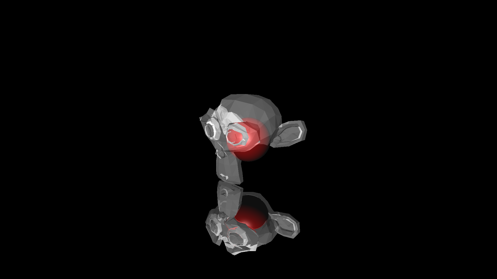
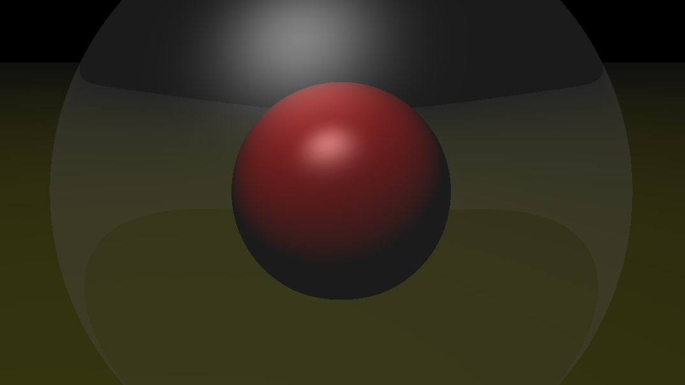
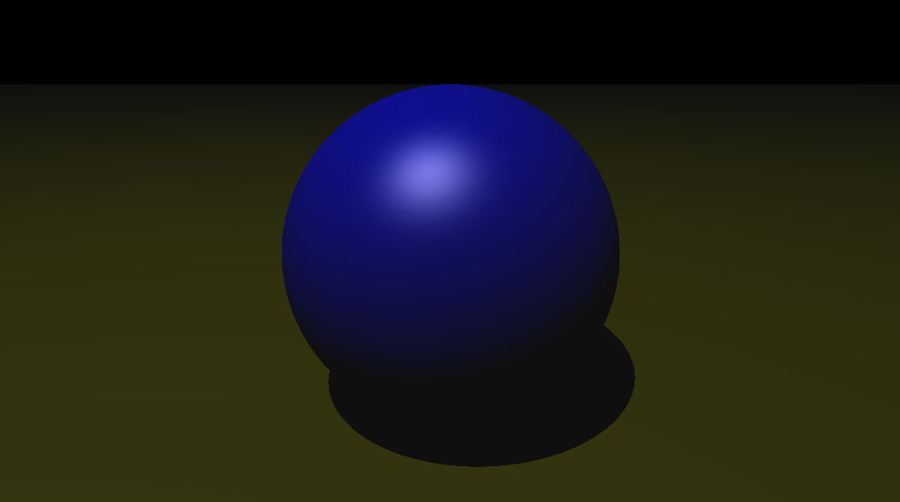

# Ray Tracer

Este projeto de Ray Tracing foi desenvolvido para a cadeira IF680 - Processamento Gráfico. Ele implementa um renderizador que simula o comportamento da luz ao interagir com objetos, criando imagens realistas através de algoritmos de traçado de raios.

### Descrição do Projeto
O Ray Tracer renderiza objetos tridimensionais, calculando reflexões, refrações, sombras e iluminação, proporcionando uma imagem final visualmente detalhada e precisa. Este projeto foi projetado para explorar conceitos de processamento gráfico avançado, incluindo a física de interação da luz e a otimização de desempenho.

Funcionalidades
Renderização de Objetos: Suporta formas geométricas como esferas, planos e cubos.
Iluminação: Iluminação direcional e pontual com suporte a sombras.
Reflexão e Refração: Simulação de superfícies reflexivas e transparentes.
Multithreading: Utilização de múltiplos threads para otimizar o processo de renderização.
Personalização: Estrutura flexível para adição de novos objetos e materiais.

### Como Executar


```
git clone https://github.com/Stozux/Ray_Tracer.git
cd Ray_Tracer
g++ .\main.cpp -O3
.\a.exe > image.ppm 
```
### Exemplo de Imagens Renderizadas




